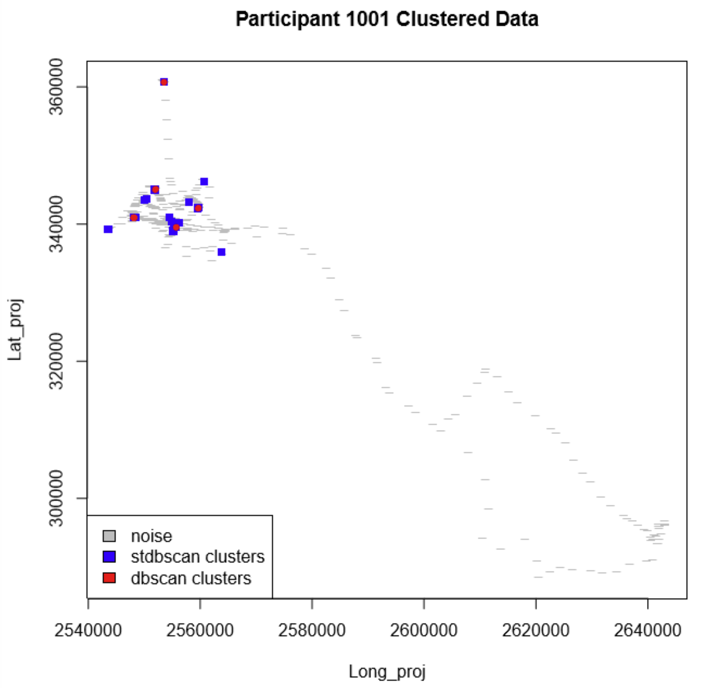
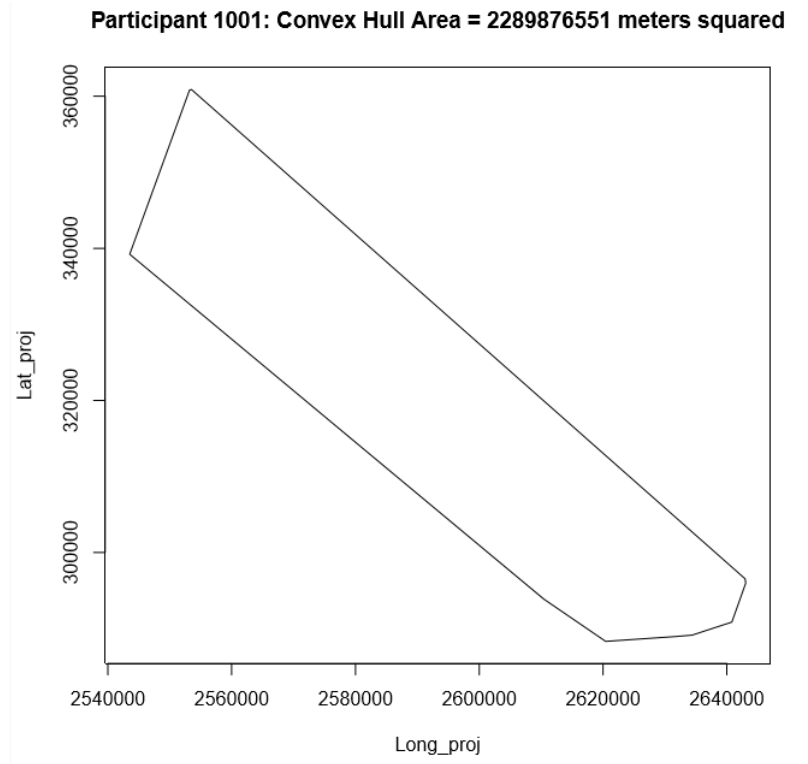
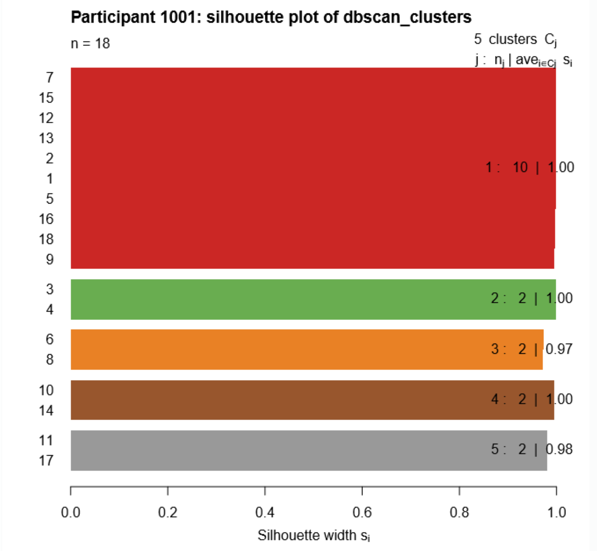

<h1 class="title toc-ignore">Using Density-Based Spatial Cluster Analysis to Study Health-Related Mobility and Community Participation</h1>
<h4 class="author">Eugene Brusilovskiy, Ess Jaraha, Louis A. Klein, Mark S. Salzer</h4>

<em>Department of Rehabilitation Sciences, Temple University, Philadelphia, PA, USA</em>

<h2>Introduction</h2>

Community Participation, as indicated by mobility and engagement in socially meaningful activities, is a central component of health based on the International Classification of Health, Functioning, and Disease (WHO,2001). Global position systems (GPS) technology is emerging as a tool for tracking mobility and participation in health and disability-related research. In an ongoing study, the Temple University Collaborative on Community Inclusion uses AccuTracking Software to collect GPS data from 120 participants with psychiatric disabilities. Participants carried GPS-enabled cell phones which recorded their location every minute for two weeks. This document shows a workflow for processing the data in R. Two density-based spatial clustering algorithms are used: ST-DBSCAN and DBSCAN.

<h2>Working with GPS data</h2>

There are often inaccuracies and errors associated with GPS data, due to factors including, but not limited to, atmospheric conditions, satellite and reciever errors, and multipath errors. These are reflected in the data as duplicate records, inaccurate coordinates, and missing data. Consequently, the data must be processed before and after clustering.

<h2>Analysis</h2>

<h3>1. Preprocessing</h3>

During preprocessing, four main operations are applied:

<ol style="list-style-type: decimal">
<li><strong>duplicate records are removed</strong></li>
<li><strong>outliers are smoothed</strong>
<ul>
<li>an outlier is defined as an observation that is &lt;= 1 minute and &gt; 200 meters from its adjacent observations, where the adjacent observations are &lt;= 2 minutes and &lt; 200 meters from each other. these scenarios correspond to innaccurate coordinates from the GPS. the coordinates of the outlier observation are redefined as the average of its adjacent observations.</li>
</ul></li>
<li><strong>lost data is recovered through imputation</strong>
<ul>
<li>coordinates of observations with a time gap &lt;= 20 minutes are linearly imputed.</li>
</ul></li>
<li><strong>distance and time fields are calulated</strong></li>
</ol>
<h3>2. ST-DBSCAN</h3>

ST-DBSCAN is a spatiotemporal, density-based clustering algorithm. It clusters observations according to three parameters:

<ul>
<li><strong>eps1</strong>: spatial distance</li>
<li><strong>eps2</strong>: non-spatial distance (for the purposes of this analysis, eps2 is time)</li>
<li><strong>minpts</strong>: minimum number of points necessary to form a cluster</li>
</ul>

In this analysis, eps1=200 meters, eps2=20 minutes, and minpts=10 points. Therefore, observations within 200 meters and 20 minutes of at least nine other observations will be clustered. The clusters that result from ST-DBSCAN represent destinations visited by the participant.

<h3>3. Postprocessing and DBSCAN</h3>

Postprocessing accounts for errors and innacuracies from the STDBSCAN step that were initially caused by GPS errors and innaccuracies.

During postprocessing, four main scenarios are accounted for:

<ol style="list-style-type: decimal">
<li><strong>scenario 1</strong>: signal is lost upon arrival at destination, and regained upon departure. arrival/departure points appear as transit points in the data and were not clustered.
<ul>
<li>two adhacent, unclustered observations with distance &lt;= 200 meter and 20 &lt;= time gap &lt;= 720 minutes are assigned to a unique cluster.</li>
</ul></li>
<li><strong>scenario 2</strong>: GPS error results in a time gap &gt; 20 minutes, so imputation did not occur. The observation that <em>follows</em> the GPS-error-induced time gap was not clustered because of the large time gap. the adjacent observation that precedes the unclustered observation was clustered.
<ul>
<li>the unclustered observation is assigned to the cluster of the adjacent clustered observation if it has a distance &lt;= 200 meters and a 20 &lt;= time gap &lt;= 720.</li>
</ul></li>
<li><strong>scenario 3</strong>: GPS error results in a time gap &gt; 20 minutes, so imputation did not occur. The observation that <em>precedes</em> the GPS-error-induced time gap was not clustered because of the large time gap. the adjacent observation that follows the unclustered observation was clustered.
<ul>
<li>the unclustered observation is assigned to the cluster of the adjacent clustered observation if it has a distance &lt;= 200 meters and a 20 &lt;= time gap &lt;= 720.</li>
</ul></li>
<li><strong>scenario 4</strong>: signal is lost while at a destination. when signal returns, a new cluster is formed at the same destination. this results in two clusters that represent the same instance at a location.
<ul>
<li>two clusters are combined if their centroids are within 200 meters and their time ranges fall within 20 to 720 minutes of each other. the higher cluster id will be preserved.</li>
</ul></li>
</ol>

After postprocessing, stdbsan-clusters are clustered spatially using the dbscan package. The clusters resulting from DBSCAN clustering represent repeated destinations.

<h3>4. Data Visualization</h3>

Three functions were developed to visualize participant data.

<ol style="list-style-type: decimal">
<li><strong>cluster_plot</strong>: scatter plot of <strong>stdbscan clusters</strong>, <strong>dbscan clusters</strong>, and non-clustered points for a participant</li>
<li><strong>chull_area_plot</strong>: polygon plot showing the <strong>convex hull</strong> and area of the convex hull for a participant</li>
<li><strong>silhouette_dbscan</strong>: bar plot showing results from a <strong>silhouette analysis</strong> on dbscan clusters
<ul>
<li>a silhouette analysis is an internal validation method which assigns a score (si) to clusters based on the distance between points within a cluster and the distance between clusters. more information can be found in the <a href="https://www.rdocumentation.org/packages/cluster/versions/2.0.9/topics/silhouette">silhouette function documentation</a>.</li>
</ul></li>
</ol>

All functions generate pdfs and require two types of input:

<ol style="list-style-type: decimal">
<li>path(s) to the files containing the necessary data</li>
<li>path to the pdf to be created</li>
</ol>

  

<h2>References</h2>

World Health Organization, 2001. ICF: International Classification of Functioning, Disability, and Health (Geneva).

